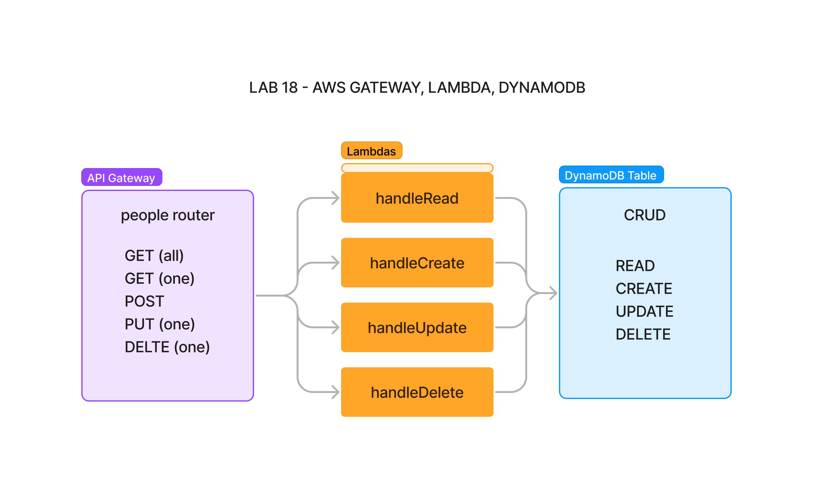

# 401 - Lab 18 - AWS Gateway, Lambda, DynamoDB

## Project: Create a serverless REST API

### Author: Melo

### Problem Domain

Create a single resource REST API using a domain model of your choosing, constructed using AWS Cloud Services.

### Feature Tasks & Requirements

* **Database:** DynamoDB
  * 1 Table required

* **Routing:** API Gateway
  * **POST**
    * /people - Given a JSON body, inserts a record into the database.
    * returns an object representing one record, by its id (##).
  * **GET**
    * /people - returns an array of objects representing the records in the database.
    * /people/## - returns an object representing one record, by its id (##).
  * **PUT**
    * /people/## - Given a JSON body and an ID (##), updates a record in the database.
    * returns an object representing one record, by its id (##).
  * **DELETE**
    * /people/## - Given an id (##) removes the matching record from the database.
    * returns an empty object.
  * **CRUD Operation Handlers:** Lambda Functions

## Documentation



### Deployed Links

* Link to API Root URL (GET all) ---> [GET all](https://90unb4va0h.execute-api.us-east-1.amazonaws.com/dev/people)
* Link to API (GET one) ---> [GET first item](https://90unb4va0h.execute-api.us-east-1.amazonaws.com/dev/people/1)
* Link to API (GET one) ---> [GET second item](https://90unb4va0h.execute-api.us-east-1.amazonaws.com/dev/people/2)

### Inputs required

* **handleCreate** - request body

    ```javascript
    {
    "id": "3",
    "name": "TestPersonThree",
    "phone": "333-333-3333"
    }
    ```

* **handleRead** - path parameter
* **handleUpdate** - request body, and path parameter id

    ```javascript
    {
    "name": "UpdateNameTestPersonThree",
    }
    ```

* **handleDelete** - path parameter

### Outputs returned

* handleCreate - response object (success or error)
* handleRead - response object (success or error)
* handleUpdate - response object (success or error)
* handleDelete - response object (success or error)

### Testing

Conducted via:

* **Lambda** -  API proxy test environment
* **API Gateway** - test endpoints (check responses)
* **DynamoDB**- test create, update, delete reflect as expected after lambda execution.

### Link to Pull Request ---> [Pull Request](https://github.com/MelodicXP/serverless-api/pull/1)
